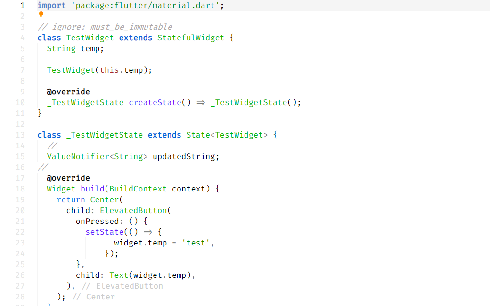

# README

I could not find any Light Theme that could work seamlessly with Flutter differentiating Widgets and methods. So I created one on my own. I will always try to keep this updated. Any comments and contributions are always welcome.

