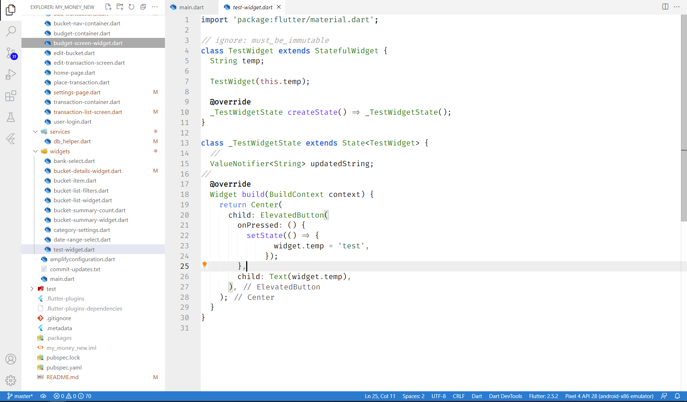

# README

I could not find any Light Theme that could work seamlessly with Flutter differentiating Widgets and methods. So I created one on my own. I will always try to keep this updated. Any comments and contributions are always welcome.

v2.0.0
  - Increased Contrast and Updated for XML as well , since Flutter needs to update XML files often
  - Removed any references to the extension .dart to make it generic

v2.1.0
  - Updated colors for 'Go To File' Panel

v2.1.1
  - Updated colors for better contrast in terminal and editor/explorer

